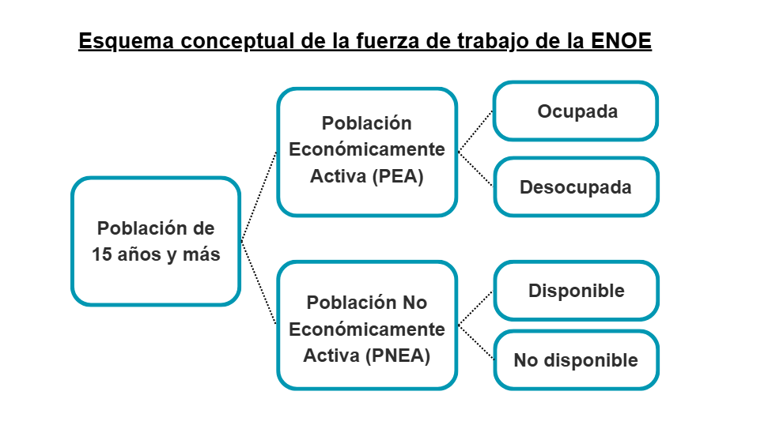

<style>
h1.title { color: #6A5ACD; font-weight: bold; }
h4.subtitle { color: #333; font-style: italic;  font-size: 16px;}
h4.author { color: #333; font-style: italic;  font-size: 16px;}
</style>


```{r setup, include=FALSE}
knitr::opts_chunk$set(echo = TRUE)
```

### **1. Objetivo**

El presente informe tiene como objetivo principal analizar y exponer las dinámicas clave de las mujeres en el mercado laboral mexicano, utilizando datos con perspectiva de género provenientes de la Encuesta Nacional de Ocupación y Empleo (ENOE) del Instituto Nacional de Estadística y Geografía (INEGI).

La investigación se centra en los siguientes desafíos fundamentales que enfrentan las mujeres en el ámbito laboral: la brecha de acceso al empleo, las condiciones de precariedad en que lo ejercen y el impacto de la maternidad en su trayectoria profesional.

### **2. Preguntas centrales de la investigación**

Para dar respuesta a este objetivo y profundizar en los desafíos identificados, se formulan las siguientes preguntas centrales que orientan el análisis de la participación económica de las mujeres en el mercado laboral mexicano:

a. *¿Cuál es el porcentaje de empleos en México que son ocupados por mujeres?*

b. *¿Cuál es la tasa de informalidad que enfrentan las mujeres que tienen un empleo?*

c. *¿Cómo se ve afectada la participación económica de las mujeres a medida que aumenta el número de hijos?*

d. *¿Cómo se comporta el ingreso promedio mensual de las mujeres ocupadas en función del número de hijos que tienen?*


### **3. Descripción de la ENOE y conceptos clave**
#### <u>3.1 ¿Qué es la ENOE?</u>

La Encuesta Nacional de Ocupación y Empleo (ENOE), realizada por el INEGI, es la principal fuente de información sobre el mercado laboral mexicano. Esta encuesta proporciona datos detallados sobre la fuerza laboral (como la ocupación, la desocupación, la informalidad laboral, etc.) con representatividad a nivel nacional, estatal y por ciudades, lo que la convierte en una herramienta fundamental para comprender la dinámica del empleo en el país.

#### <u>3.2 Conceptos clave de la fuerza de trabajo</u> 

La ENOE utiliza una clasificación jerárquica para identificar y segmentar a la Población en Edad de Trabajar (PET), definida como las personas de 15 años y más, según su relación con el mercado laboral:

* **Población Económicamente Activa (PEA):** Incluye a todas las personas en edad de trabajar que tienen un empleo o que están buscando activamente uno. Se divide en los siguientes grupos:
    * **Población Ocupada:** Aquellas personas que realizaron alguna actividad económica (remunerada o no remunerada en negocios familiares). 
    * **Población Desocupada:** Personas que no tenían empleo, pero sí buscaron activamente uno y estaban disponibles para trabajar.

* **Población No Económicamente Activa (PNEA):** Personas que no estuvieron ocupadas ni buscaron activamente un empleo:
    * **Población Disponible:** Son las personas que aceptarían un trabajo si se les ofreciera, pero no buscaron activamente uno debido a razones específicas.
    * **Población No disponible:** Son aquellas que no tienen interés o necesidad de trabajar. Incluye estudiantes (que no buscan empleo), jubilados, personas con incapacidades o quienes se dedican exclusivamente a sus quehaceres domésticos.



#### <u>3.3 Estructura de la ENOE</u>

La base de datos de la ENOE se organiza en cinco tablas principales interconectadas que almacenan la totalidad de la información captada. El conjunto de datos sigue una jerarquía que va del nivel geográfico y habitacional al nivel individual:

* **Tabla de Vivienda:** Contiene datos de identificación de las viviendas, el número de residentes y la composición de los hogares.

* **Tabla de Hogares:** Almacena la identificación de cada hogar dentro de la vivienda, así como los detalles y resultados (fechas y estado) de la entrevista.

* **Tabla Sociodemográfico:** Almacena las características individuales de los residentes del hogar (condición de residencia, edad, sexo, etc.).

* **Cuestionario de Ocupación y Empleo (COE1 y COE2):** Debido a su extensión, se divide en dos tablas. En ellas se registra la información detallada sobre la situación laboral de la población de 15 años y más, incluyendo la condición de actividad económica y no económica.


#### <u>3.4 Diseño muestral de la ENOE</u>

El diseño muestral de la ENOE se caracteriza por ser probabilístico, por lo cual los resultados obtenidos de la encuesta se generalizan a toda la población, a su vez es bietápico, estratificado y por conglomerados, donde la unidad última de observación es la persona que al momento de la entrevista tenga 15 años cumplidos o más de edad.

#### <u>3.5 Selección de base de datos Sociodemográfico para el análisis</u>

La base Sociodemográfico fue seleccionada porque ofrece la unidad de análisis individual necesaria para estudiar las condiciones laborales desde una perspectiva de género. Además, al integrar información tanto sociodemográfica como ocupacional, permite analizar cómo las características personales y familiares inciden en la participación económica de la población. Esta amplitud de variables hace posible un análisis integral y comparativo de las desigualdades laborales que enfrentan las mujeres en el mercado de trabajo mexicano.


### **4. Procesamiento de la base de datos**

#### <u>4.1 Importación y exploración de datos</u>

Importar librerías.
```{r librerias, message=FALSE, warning=FALSE}
#install.packages("survey")
#install.packages("srvyr")
#install.packages("kableExtra")
#install.packages("kable")

library(knitr)
library(kableExtra)
library(tidyverse)
library(readr)
library(survey)
library(srvyr)
library(ggplot2)
```

Importar la *base sociodemográfica* del último trimestre disponible de la ENOE (2do trimestre de 2025).
```{r importo_base}
enoe_2t24 <- read.csv("datos/ENOE_SDEMT225.csv")
```

Conocer la cantidad de filas y columnas dentro de la base de datos.
```{r tamaño de la base}
dim(enoe_2t24)
```

Conocer el nombre de las variables de la base de datos.
```{r}
colnames(enoe_2t24)
```


#### <u>4.2 Transformación de la base de datos</u>

Para el análisis se realiza una selección de variables en donde se extraen únicamente las variables necesarias para responder las preguntas de investigación. Esta selección permite reducir el tamaño de la base de datos y concentrar la información en los aspectos relevantes del estudio.
```{r}
sdem <- enoe_2t24 %>%
 select(
        c_res, #condición de residencia
        r_def, #resultado definitivo de la entrevista
        sex, #género 
        eda, #edad
        n_hij, #número de hijos
        ingocup, #ingreso mensual
        emp_ppal,#Condición del empleo (formal o informal)
        clase1, #clasificación de la población en PEA y PNEA
        clase2, #clasificación de la población ocupada y desocupada; disponible y no disponible
        est_d_tri, #estrato de diseño trimestral
        fac_tri,#ponderador trimestral
        upm #unidad primaria de muestreo
 )
```

Luego, se realiza un filtrado general de la base de datos aplicando las condiciones establecidas por el INEGI para garantizar la validez y consistencia del análisis. En este proceso, se incluyen variables clave como *c_res* (condición de residencia) y *r_def* (resultado definitivo de la entrevista), las cuales permiten asegurar que el análisis se limite a personas residentes en el país y con entrevistas completas, garantizando así la calidad de los datos utilizados.

Asímismo, se establece una condición sobre la variable *eda* (edad), considerando únicamente a personas de 15 años o más, conforme a los criterios oficiales de la ENOE. Esta restricción responde tanto a la definición estadística de la población en edad de trabajar como al marco legal nacional e internacional, que fija los 15 años como el umbral mínimo para integrar la fuerza laboral reconocida.
```{r}
sdem_filtrada <- sdem %>%
  mutate(
    # Asegurar que las variables numéricas se lean correctamente 
    eda = as.numeric(as.character(eda)),
    c_res = as.numeric(c_res),
    
    # Reetiquetar la principal variable de interés para facilitar el análisis 
    sex = factor(sex,
                 levels = c(1, 2),
                 labels = c("Hombre", "Mujer")),
  ) %>%
  
    # Filtrar observaciones válidas 
  filter(
    c_res %in% c(1, 3),     # residente habitual o nuevo residente
    r_def == 00,            # entrevista completa
    eda >= 15 & eda <= 98,  # edad laboral según INEGI
  )
```

Para garantizar que los resultados obtenidos sean representativos de toda la población y no solo de las personas encuestadas, se construye el diseño muestral de la ENOE. Este procedimiento permite que los cálculos de tasas, promedios o proporciones consideren la estructura de la muestra y los factores de expansión definidos por el INEGI.

En términos simples, este paso le indica a R cuántas personas representa cada registro de la encuesta y cómo fue seleccionada la muestra, asegurando que los resultados reflejen correctamente la realidad nacional.

Los principales componentes del diseño son:

* **upm (Unidad primaria de muestreo):** identifica los conglomerados o unidades primarias seleccionadas.

* **est_d_tri (Estrato de diseño trimestral):** permite controlar la variabilidad dentro de cada estrato de muestreo.

* **fac_tri (Factor de expansión trimestral):** pondera cada observación para que los resultados sean extrapolables a la población total.

La función *as_survey_design()* del paquete survey permite especificar estos componentes dentro de R, asegurando que todas las estimaciones, proporciones y totales se calculen respetando la estructura del muestreo complejo de la ENOE. Finalmente, se ajusta la opción *survey.lonely.psu = "adjust"* para corregir posibles estratos con una sola unidad primaria de muestreo, evitando sesgos y errores en las estimaciones.
```{r}
# Crear diseño muestral para la base filtrada
sdemsvy <- sdem_filtrada%>%
  as_survey_design(
    ids = upm, 
    strata = est_d_tri, 
    nest = TRUE, 
    weights = fac_tri
  )

#Ajustar diseño muestral
options(survey.lonely.psu = "adjust")  
```

#### <u>4.3 Análisis de la base de datos</u>

En esta sección se presentan los análisis realizados con el propósito de responder las preguntas centrales de la investigación:


<span style="color:#b22222"> a. *¿Cuál es el porcentaje de empleos en México que son ocupados por mujeres?*</span>

Antes de responder esta pregunta, se realizó un análisis general del panorama laboral por género en México. En primer lugar, se identificó el total de mujeres y hombres que forman parte de la Población Económicamente Activa (PEA), es decir, aquellas personas de 15 años y más que tienen un empleo o que buscan activamente uno. Posteriormente, se contabilizó la Población Ocupada, que corresponde a quienes efectivamente desempeñan una actividad laboral dentro de la PEA.

A partir de ambos indicadores, se estimó la tasa de ocupación por sexo, entendida como la proporción de personas con empleo respecto al total de la PEA. Este indicador permite conocer qué porcentaje de mujeres y hombres que participan activamente en el mercado laboral cuentan efectivamente con un empleo. La tasa se calculó mediante la siguiente fórmula:


$$
\text{Tasa de ocupación}_{sexo} = \left( \frac{\text{Ocupados}_{sexo}}{\text{PEA}_{sexo}} \right) \times 100
$$

```{r}
#Población Económicamente Activa por sexo 
PEA_sexo <- sdemsvy %>%
  filter(clase1 == 1) %>% 
  group_by(sex) %>%
  summarise(PEA = survey_total())

#Población ocupada por sexo 
OCU_sexo <- sdemsvy %>%
  filter(clase2 == 1) %>%   
  group_by(sex) %>%
  summarise(Ocupados = survey_total())

#Juntar resultados en una sola base
PEA_OCU <- left_join(PEA_sexo, OCU_sexo, by = "sex")

#Utilizar el total de ocupados sobre el total de la PEA para obtener la proporción
PEA_OCU <- PEA_OCU %>%
  mutate(
    Prop_ocupados_en_PEA = round((Ocupados / PEA) * 100, 0))

```


```{r echo=FALSE, message=FALSE, warning=FALSE}
PEA_OCU %>%
  kbl(
    align = "c",
    col.names = c(
      "Género", 
      "Total en PEA", 
      "Error estándar PEA", 
      "Total Ocupados", 
      "Error estándar Ocupados", 
      "Tasa de Ocupación (%)"
    )
  ) %>%
  kable_styling(
    bootstrap_options = c("striped", "hover", "condensed"),
    full_width = TRUE,
    position = "left",
    font_size = 13
  ) %>%
  column_spec(
    6, bold = TRUE, color = "white", background = "grey60"
  ) 
```

Los resultados muestran que aproximadamente **97% de las personas que forman parte de la PEA —tanto hombres como mujeres— tienen un empleo**, lo que refleja un alto nivel de inserción laboral.

Con este panorama general, el siguiente paso fue estimar la distribución de mujeres y hombres dentro de la población ocupada, con el fin de identificar qué porcentaje de los empleos corresponde a cada sexo. Esta medida permite observar la representación relativa de las mujeres en el total de empleos del país. 

La distribución por sexo se calculó de la siguiente forma:

$$
\text{Distribución de personas ocupadas}_{sexo}  = \left( \frac{\text{Ocupados}_{sexo}}{\text{Ocupados}_{total}} \right) \times 100
$$
```{r}
#Utilizar el total de mujeres y hombres ocupados sobre el total de ocupados para obtener la proporción
PEA_OCU <- PEA_OCU %>%
mutate(Prop_ocupados = round((Ocupados / sum(Ocupados)) * 100, 0))
```


```{r echo=FALSE,  fig.align='center'}
#Crear gráfico de pastel sobre proporción de ocupados por sexo
ggplot(PEA_OCU, aes(x = "", y = Prop_ocupados, fill = sex)) +  #Se definen los datos
  geom_col(width = 2, color = "white") +                       #Crea las barras (que luego se transforman en pastel)
  coord_polar(theta = "y") +                                   #Convierte el gráfico de barras en circular
  geom_text(                                                   #Agrega etiquetas con los porcentajes
    aes(label = paste0(round(Prop_ocupados, 1), "%")),
    position = position_stack(vjust = 0.5),
    color = "white",
    fontface = "bold",
    size = 4
  ) +
  scale_fill_manual(                                           #Define colores personalizados por sexo
    values = c("Mujer" = "#6A5ACD", "Hombre" = "gray60"),
    labels = c("Hombre", "Mujer")
  ) +
  labs(                                                        #Agrega título, subtítulo y fuente
    title = "Menos de la mitad de los empleos\n en el mercado laboral son ocupados por mujeres",
    subtitle = "Proporción de la población ocupada por sexo",
    caption = "Fuente: Elaboración propia con datos de la ENOE 2T 2025 (INEGI)"
  ) +
  theme_void() +                                               #Elimina ejes, fondo y cuadrículas
  theme(
    plot.title = element_text(                                 #Ajusta el estilo del título
      face = "bold", color = "#6A5ACD", size = 13,
      hjust = 0.5, margin = margin(t = 10, b = 5)
    ),
    plot.subtitle = element_text(                              #Ajusta el subtítulo
      size = 12, hjust = 0.5, margin = margin(b = 15)
    ),
    legend.position = "right",                                 #Coloca la leyenda a la derecha
    legend.title = element_blank(),                            #Oculta el título de la leyenda
    plot.caption = element_text(                               #Da formato al pie de fuente
      size = 9, hjust = 0.5, margin = margin(t = 15)
    ),
    plot.margin = margin(5, 5, 5, 5)                           #Reduce márgenes para agrandar el gráfico
  )

```

En síntesis, aunque la tasa de ocupación es alta para ambos sexos (alrededor del 97%), la distribución del empleo revela una brecha persistente en la participación femenina. **Del total de personas con un empleo, solo 41% son de mujeres**, lo que refleja que, pese a tener niveles similares de participación económica que los hombres, las mujeres continúan teniendo una menor representación dentro del mercado laboral.


<span style="color:#b22222">b. *¿Cuál es la tasa de informalidad que enfrentan las mujeres que tienen un empleo?* </span>

Para responder esta pregunta, se analizó la proporción de mujeres y hombres ocupados que trabajan en el sector informal. Este indicador permite dimensionar la precariedad laboral y las desigualdades estructurales que enfrentan las mujeres en el acceso a empleos con protección social y seguridad laboral.

En primer lugar, se identificó a la población ocupada total —es decir, a las personas que tienen un empleo—. Dentro de este grupo, se filtraron aquellos casos clasificados como trabajadores informales, siguiendo el criterio del INEGI *(variable emp_ppal == 1)*, que agrupa a quienes laboran sin acceso a instituciones de seguridad social o en unidades económicas no registradas formalmente.

```{r}
#Población en la informalidad de la población ocupada
INF_sexo <- sdemsvy %>%
  filter(clase2 == 1, emp_ppal == 1) %>% 
  group_by(sex) %>%
  summarise(Informales = survey_total())

# Unir tabla Ocupados elaborada en la primera parte con la nueva tabla de informalidad
OCU_INF <- left_join(OCU_sexo, INF_sexo, by = "sex")
```

Posteriormente, se estimó la tasa de informalidad por sexo, la cual muestra qué proporción de hombres y mujeres de las personas ocupadas se encuentran en condiciones de informalidad laboral. La fórmula aplicada fue la siguiente:

$$
\text{Tasa de informalidad}_{sexo} = \left( \frac{\text{Población ocupada informal}_{sexo}}{\text{Población ocupada total}_{sexo}} \right) \times 100
$$

```{r}
#Calcular la tasa de informalidad 
OCU_INF <- OCU_INF %>%
  mutate(
    Tasa_Informalidad = round(Informales / Ocupados * 100, 0)
  )
```


```{r echo=FALSE, fig.align='center'}
#Crear gráfico de puntos sobre la tasa de informalidad por sexo
ggplot(OCU_INF, aes(x = sex, y = Tasa_Informalidad, fill = sex)) +   #Se definen los datos base (sexo y tasa)
  geom_point(size = 8, shape = 21, color = "black") +                #Crea puntos grandes que representan cada valor
  geom_text(                                                         #Agrega etiquetas con el porcentaje
    aes(label = paste0(Tasa_Informalidad, "%")),
    vjust = -1.2, size = 5, fontface = "bold"
  ) +
  scale_fill_manual(                                                 #Asigna colores personalizados por sexo
    values = c("Mujer" = "#6A5ACD", "Hombre" = "gray60")
  ) +
  scale_y_continuous(                                                #Ajusta el eje Y para enfocar el rango de valores
    limits = c(53, 56),                                              #Define los límites del eje Y
    breaks = seq(53, 56, 0.5)                                        #Coloca marcas cada 0.5%
  ) +
  labs(                                                              #Agrega título, subtítulo y fuente
    title = "Las mujeres que tienen un empleo tienen una mayor probabilidad de\nhacerlo en la informalidad",
    subtitle = "Tasa de informalidad laboral por sexo",
    caption = "Fuente: Elaboración propia con datos de la ENOE 2T 2025 (INEGI)",
    x = "", y = ""
  ) +
  theme_minimal() +                                                  #Aplica un estilo visual limpio
  theme(
    plot.title = element_text(                                       #Da formato al título principal
      face = "bold", size = 14, color = "#6A5ACD"
    ),
    plot.subtitle = element_text(size = 10),                         #Da formato al subtítulo
    plot.caption = element_text(size = 9, hjust = 0.0),              #Da formato a la fuente (alineada a la izquierda)
    legend.position = "none"                                         #Elimina la leyenda (los colores ya son distintivos)
  )

```

Los resultados muestran que **la tasa de informalidad laboral es de 55% para las mujeres y 54% para los hombres**, lo que indica que más de la mitad de las personas ocupadas en México trabajan en condiciones de informalidad. Esta alta proporción revela la magnitud estructural de la informalidad en el país, un fenómeno que afecta de manera generalizada la calidad del empleo y el acceso a la protección social.

No obstante, las implicaciones de la informalidad tienden a ser más adversas para las mujeres, ya que enfrentan de manera simultánea brechas salariales y una mayor carga de trabajo no remunerado en el hogar. En este sentido, aunque el empleo informal puede ofrecerles cierta flexibilidad para compatibilizar las responsabilidades domésticas y de cuidado, también implica una posición más vulnerable en términos de estabilidad, ingresos y seguridad social.


<span style="color:#b22222"> c. *¿Cómo se ve afectada la participación económica de las mujeres a medida que aumenta el número de hijos?*</span>


Para responder esta pregunta, se estimó la tasa de participación laboral femenina, un indicador que mide la proporción de mujeres que forman parte de la Población Económicamente Activa (PEA) respecto al total de mujeres en edad de trabajar (15 años o más). En otras palabras, esta tasa refleja el grado de incorporación de las mujeres al mercado laboral.

El análisis se centró en examinar cómo varía la participación laboral de las mujeres según el número de hija(o)s, con el propósito de evaluar el efecto de la carga familiar en sus oportunidades de empleo. Dado que la maternidad puede influir en la disponibilidad de tiempo, las trayectorias laborales y el acceso a empleos formales, resulta relevante cuantificar estas diferencias.

Para ello, se consideraron únicamente mujeres de 15 años y más, clasificadas en seis grupos según la cantidad de hija(o)s, con el fin de comparar los niveles de participación económica entre quienes enfrentan distintas responsabilidades familiares.

```{r}

#Filtrar a mujeres únicamente
TPLF_hijos <- sdemsvy %>%
  filter(sex == "Mujer") %>%  
  
  #Crear clasificación de número de hija(o)s
  mutate(
    grupo_hijos = case_when(
      n_hij == 0 ~ "Sin hija(o)s",
      n_hij == 1 ~ "1 hija(o)s",
      n_hij == 2 ~ "2 hija(o)s",
      n_hij == 3 ~ "3 hija(o)s",
      n_hij == 4 ~ "4 hija(o)s",
      n_hij >= 5 ~ "5 o más hija(o)s",
      TRUE ~ NA_character_   #NA para no especificados
    )
  ) %>%
  
  #Excluir NA en la categorización
  filter(!is.na(grupo_hijos)) %>%
  
  #Agrupar por categoría de hijos
  group_by(grupo_hijos) %>%
  
  #Calcular totales ponderados según el diseño muestral
  summarise(
    PEA = survey_total(clase1 == 1, na.rm = TRUE),  # Mujeres en la PEA
    Total = survey_total(na.rm = TRUE)              # Total de mujeres (15+)
  ) 
```

Finalmente, se estimó para cada grupo el total de mujeres en la PEA y el total de mujeres en edad de trabajar, a partir de los cuales se calculó la tasa de participación laboral femenina mediante la siguiente fórmula:


$$
\text{Tasa de participación laboral femenina}_{hijos} = \left( \frac{\text{PEA}_{hijos}}{\text{Total mujeres 15+}_{hijos}} \right) \times 100
$$


```{r}
#Calcular la tasa de participación laboral femenina
TPLF_hijos <- TPLF_hijos %>%
  mutate(
    TPLF = round((PEA / Total) * 100, 0)
  ) 
```


```{r echo=FALSE, fig.align='center', message=FALSE, warning=FALSE}

# Extraer el valor de referencia (TPLF de las mujeres sin hijas)
ref_sin_hijos <- TPLF_hijos %>% 
  filter(grupo_hijos == "Sin hija(o)s") %>%   # Filtra solo las mujeres sin hijas
  pull(TPLF)                                  # Extrae su tasa de participación laboral (valor numérico)

# Eliminar la categoría "Sin hijas" del conjunto de datos para no graficarla como barra
TPLF_hijos_filtrado <- TPLF_hijos %>%
  filter(grupo_hijos != "Sin hija(o)s")

# Crear gráfico de barras sobre la tasa de participación laboral femenina según número de hijas(os)
ggplot(TPLF_hijos_filtrado, aes(x = grupo_hijos, y = TPLF)) +

  geom_col(                                   # Crea las barras principales
    fill = "#6A5ACD",                         # Color morado para las barras
    width = 0.6                               # Ancho moderado de las barras
  ) +

  geom_hline(                                 # Agrega una línea de referencia punteada
    yintercept = ref_sin_hijos,               # Valor correspondiente a las mujeres sin hijas
    linetype = "dashed",                      # Línea discontinua
    color = "darkred",                        # Color rojo oscuro para destacarla
    size = 1
  ) +

  annotate(                                   # Agrega texto descriptivo a la línea de referencia
    "text",
    x = 3.5, y = ref_sin_hijos + 2,           # Ubicación del texto sobre el gráfico
    label = paste0("Sin hija(o)s: ", ref_sin_hijos, "%"),
    color = "darkred",
    fontface = "bold",
    size = 4,
    hjust = 0
  ) +

  geom_text(                                  # Agrega etiquetas de porcentaje sobre cada barra
    aes(label = paste0(TPLF, "%")),
    vjust = -0.3,                             # Coloca el texto ligeramente encima de la barra
    size = 4,
    fontface = "bold"
  ) +

  labs(                                       # Define los títulos y etiquetas del gráfico
    title = "El número de hijos impacta en la participación económica de las mujeres",
    subtitle = "Tasa de participación laboral femenina según número de hija(o)s",
    x = "",
    y = "",
    caption = "Fuente: Elaboración propia con datos de la Encuesta Nacional de Ocupación y Empleo (ENOE) 2T 2025 del INEGI"
  ) +

  theme_classic() +                           # Usa un tema limpio y sobrio
  theme(                                      # Personaliza detalles estéticos
    plot.title = element_text(
      face = "bold", color = "#6A5ACD", size = 13
    ),
    plot.subtitle = element_text(size = 12),
    axis.text.x = element_text(size = 10),
    axis.text.y = element_text(size = 10),
    plot.caption = element_text(size = 9, hjust = 0.0)
  )
```

Los resultados muestran una **relación inversa entre el número de hijas(o)s y la participación económica de las mujeres.** La tasa de participación laboral femenina (TPLF) es más alta entre quienes tienen un solo hijo (56%) y desciende conforme aumenta la cantidad de hijas(o)s, llegando a 25% entre las mujeres con cinco o más. Esto evidencia que la carga familiar puede limitar la inserción laboral, ya que las responsabilidades de cuidado reducen el tiempo disponible para trabajar o buscar empleo, especialmente cuando el número de dependientes crece.

Sin embargo, un hallazgo interesante es que las mujeres sin hijas(o)s presentan una tasa de participación menor (47%) que aquellas con uno o dos hijos. Una posible explicación es que la maternidad genera una presión económica que impulsa a muchas mujeres a incorporarse al mercado laboral para contribuir al ingreso familiar, mientras que quienes no tienen hijos pueden no enfrentar la misma necesidad inmediata.

Este patrón también ayuda a entender, en parte, la elevada tasa de informalidad observada previamente entre las mujeres. El trabajo informal ofrece mayor flexibilidad de horarios y ubicación, lo que permite compatibilizar las responsabilidades de cuidado con la generación de ingresos. No obstante, esta flexibilidad se asocia a menor estabilidad, protección social y derechos laborales.

**En conjunto, los resultados reflejan cómo la doble carga —productiva y reproductiva— condiciona las trayectorias laborales de las mujeres, afectando tanto su participación como la calidad de su inserción en el mercado de trabajo.**


<span style="color:#b22222"> d. *¿Cómo se comporta el ingreso promedio mensual de las mujeres ocupadas en función del número de hijos que tienen?* </span>


Para responder esta última pregunta, se consideraron únicamente a las mujeres que actualmente tienen un empleo, con el objetivo de analizar cómo varía su ingreso conforme aumenta el número de hija(o)s. Esta delimitación es relevante, ya que son las mujeres empleadas quienes efectivamente perciben ingresos laborales. Además, se excluyeron los casos con ingresos iguales a cero, pues corresponden a trabajadoras que, aunque ocupadas, no reciben remuneración.

De esta forma, el análisis busca identificar cómo el número de hija(o)s incide en la situación económica y las oportunidades de desarrollo laboral de las mujeres.

```{r}

#Filtrar mujeres ocupadas con ingresos mayores a 0
ING_hijos <- sdemsvy %>%
  filter(
    sex == "Mujer",
    clase2 == 1,         #Mujeres OCUPADAS
    ingocup > 0,         #Excluir a mujeres sin ingresos
    !is.na(ingocup)      #Excluir NA.
  ) %>% 
  
  #Crear clasificación de número de hija(o)s
  mutate(
    grupo_hijos = case_when(
      n_hij == 0 ~ "Sin hija(o)s",
      n_hij == 1 ~ "1 hija(o)s",
      n_hij == 2 ~ "2 hija(o)s",
      n_hij == 3 ~ "3 hija(o)s",
      n_hij == 4 ~ "4 hija(o)s",
      n_hij >= 5 ~ "5 o más hija(o)s",
      TRUE ~ NA_character_
      )) %>%
  
  #Excluir NA en la categorización
  filter(!is.na(grupo_hijos)) %>%
  
  mutate(
    grupo_hijos = factor(grupo_hijos, 
                         levels = c("Sin hija(o)s", 
                                    "1 hija(o)s",
                                    "2 hija(o)s", 
                                    "3 hija(o)s",
                                    "4 hija(o)s",
                                    "5 o más hija(o)s"
    ))
  ) %>%
  
  #Agrupar por categoría de hijos
  group_by(grupo_hijos) %>%
  
  #Obtener el promedio de ingersos por cada categoría
  summarise(Ingreso_mensual = round(survey_mean(ingocup, na.rm = TRUE), 0))
```


```{r echo=FALSE, fig.align='center'}

ggplot(ING_hijos, aes(x = grupo_hijos, y = Ingreso_mensual)) +

  # 🔹 Barras principales (color uniforme)
  geom_col(fill = "#6A5ACD", width = 0.6) +

  # 🔹 Etiquetas con el porcentaje sobre cada barra
  geom_text(
    aes(label = paste0("$", Ingreso_mensual)),
    vjust = -0.3,
    size = 4,
    fontface = "bold"
  ) +

  # 🔹 Títulos y etiquetas
  labs(
    title = "Las mujeres experimentan una penalización salarial en la maternidad",
    subtitle = "Ingreso promedio mensual de las mujeres por número de hija(o)s",
    x = "",
    y = "",
    caption = "Fuente: Elaboración propia con datos de la Encuesta Nacional de Ocupación y Empleo (ENOE) 2T 2025 del INEGI"
  ) +

  # 🔹 Tema y personalización estética
  theme_classic() +
  theme(
    plot.title = element_text(face = "bold", color = "#6A5ACD", size = 13),
    plot.subtitle = element_text(size = 12),
    axis.text.x = element_text(size = 10),
    axis.text.y = element_text(size = 10),
    plot.caption = element_text(size = 9, hjust = 0.0)
  )
```
Los resultados muestran una tendencia clara: **el ingreso promedio mensual de las mujeres disminuye conforme aumenta el número de hijas(os).** Mientras las mujeres que no son madres perciben en promedio cerca de 9 mil pesos, aquellas con cinco o más hijas(os) ganan alrededor de 5 mil pesos es decir, casi la mitad. Esta diferencia revela la existencia de una penalización salarial asociada a la maternidad, en la que las responsabilidades familiares impactan directamente en las oportunidades de obtener mejores ingresos.

Esta brecha no puede entenderse sin considerar el contexto social en el que se inserta. En México, los estereotipos de género continúan asignando a las mujeres la principal responsabilidad del trabajo doméstico y de cuidados —una labor esencial que, hasta la actualidad, sigue sin reconocerse como trabajo remunerado—. Estas responsabilidades adicionales limitan su tiempo disponible para acceder a empleos formales o de tiempo completo, reducen sus posibilidades de ascenso y capacitación, y las empujan hacia empleos informales o de media jornada con menores ingresos y sin protección social. 

En este contexto, **la maternidad, lejos de ser un hecho neutral, se convierte en una desventaja acumulativa que restringe la participación económica de las mujeres y condiciona la calidad, estabilidad y remuneración de los empleos a los que pueden acceder.** En conjunto, estos factores profundizan las brechas de género en el mercado laboral y refuerzan las desigualdades estructurales que limitan el desarrollo económico y autonomía de las mujeres.

### **5. Conclusión**

El uso de la ENOE ofrece una gran ventaja por la amplitud y riqueza de la información que contiene, lo que permite realizar diversos tipos de análisis. En este reporte se buscó aprovechar esa base de datos para desarrollar un análisis con perspectiva de género, a fin de comprender cómo las mujeres participan en el mercado laboral y bajo qué condiciones lo hacen.

A partir de la información analizada, se observa que la participación y las condiciones laborales de las mujeres en México continúan profundamente influidas por la división sexual del trabajo y por la carga desproporcionada de cuidados. Los resultados muestran que las mujeres tienen una menor representación en el empleo y que cuando logran insertarse, lo hacen con mayor frecuencia en el sector informal. También se observó que las mujeres que son madres participan menos en el mercado laboral conforme aumenta su número de hija(o)s. Y entre quienes sí participan teniendo un empleo, sus ingresos tienden a disminuir a medida que tienen más hija(o)s.

En conjunto, los resultados confirman la persistencia de estructuras sociales que perpetúan los estereotipos de género y colocan a las mujeres en una posición de desventaja. Estas barreras estructurales se manifiestan con mayor fuerza en el mercado de trabajo, donde las dinámicas patriarcales penalizan particularmente a la maternidad, ya que es automáticamente asociada a una menor productividad. Esta percepción se traduce en menos oportunidades de empleo y crecimiento profesional, además de condiciones laborales más precarias y menos estables. 

<span style="color:#6A5ACD; font-weight:bold;"> Así, ser madre en México continúa siendo un acto de resistencia frente a un sistema que castiga el cuidado y privilegia una organización del trabajo construida sobre la desigualdad de género. </span>


